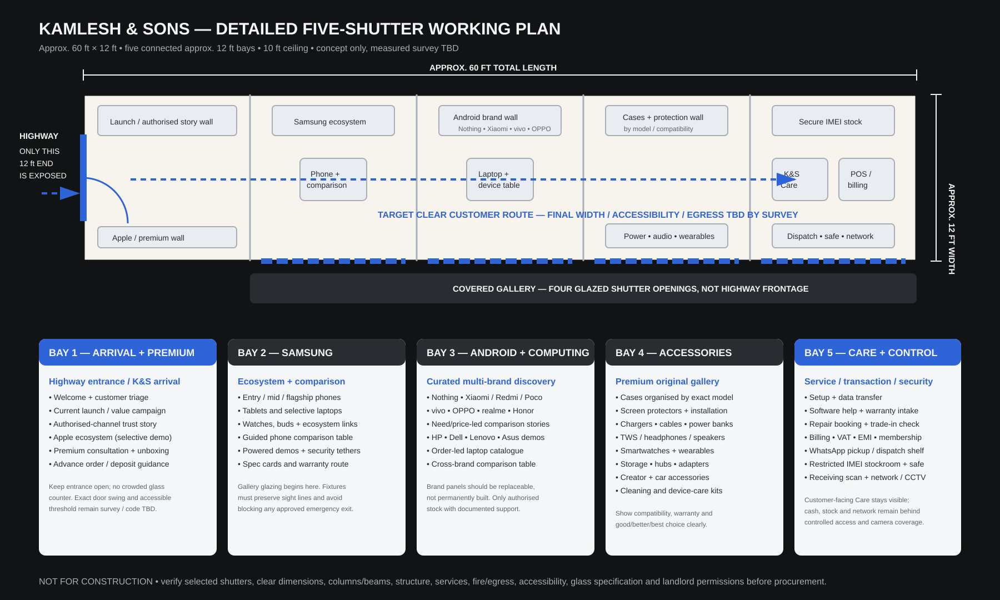
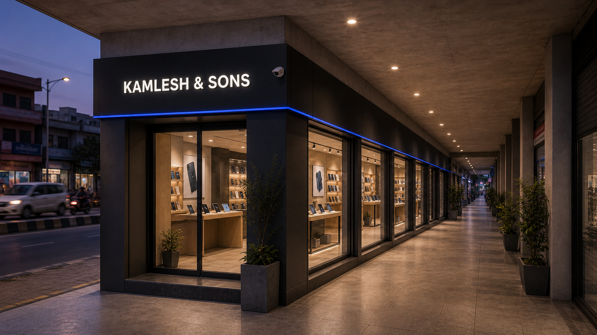
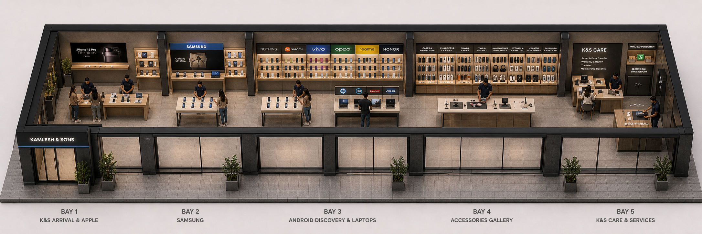
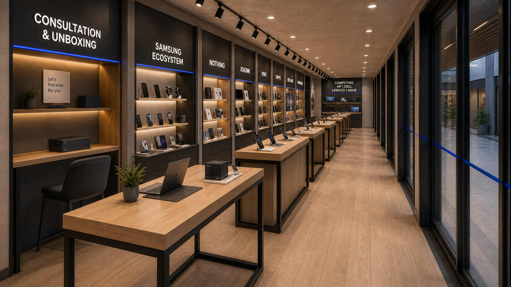
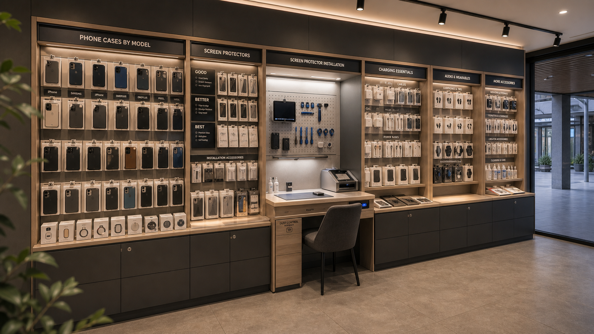
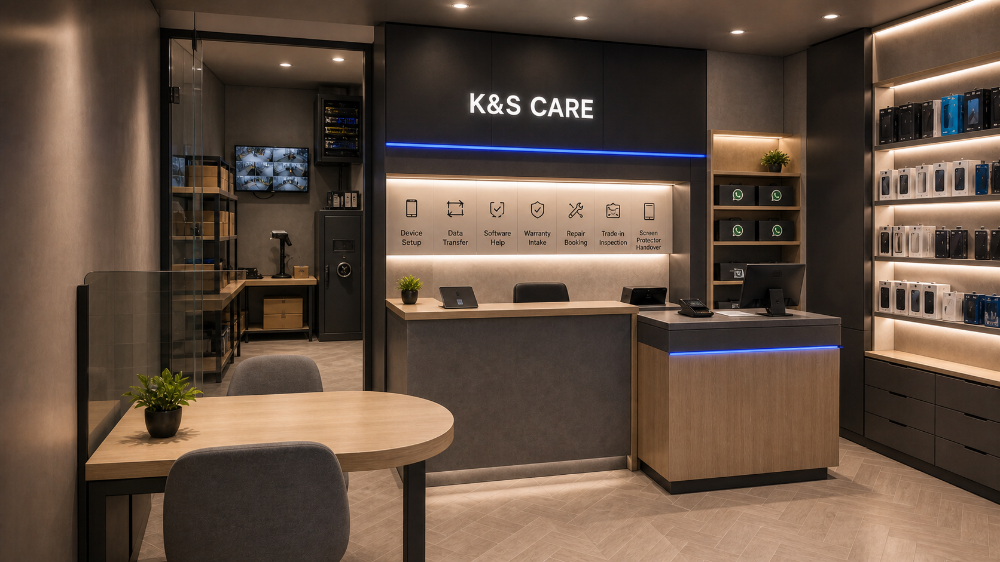

# KAMLESH Mobile — Nepalgunj Flagship Showroom Blueprint

**Document ID:** EVD-NPJ-FLAGSHIP-002
**Version:** 0.4.0
**Status:** Planning evidence — quotations, field validation and approvals pending
**Accountable owner:** Founder until site-specific owners are appointed
**Canonical dependencies:** v0.3 Store Design, v0.4 Customer Experience, v0.6 Operations & People, v0.7 Marketing, v0.8 Finance and v1.0 Flagship Ready

Planning date: August 2026
Current working footprint: approximately 60 ft long × 12 ft wide / five connected bays / approximately 720 sq ft
Measurement status: concept only; verified internal survey and structural/services plan pending
Proposed funding ceiling: NPR 1 crore
Proposed distributor BG ceiling: NPR 60 lakh

## Current working assumptions — not lease-approved facts

The latest founder input establishes the following design basis:

- All ten shutters are reportedly available; K&S intends to select five consecutive shutters including the highway-facing position.
- The footprint is reported as a long, shallow strip of approximately 60 ft × 12 ft: five approximate 12 ft × 12 ft bays in one straight row.
- Only the 12 ft short-end shutter faces the highway and forms the principal arrival. The remaining four shutters are on the perpendicular long side beside the covered gallery—not on the outer highway side—and would be fitted with glass.
- Reported shutter opening is approximately 12 ft wide × 10 ft high; reported ceiling height is approximately 10 ft.
- Approximately 720 sq ft remains the planning-area assumption. The stated 60 ft × 12 ft dimensions are approximate; clear finished dimensions and usable area remain unverified.
- Existing partition walls are reported as approximately 4 in thick. No wall may be removed until the landlord and a competent site professional confirm in writing that it is non-structural and safe to remove.
- No stair or toilet is reported inside the proposed unit. Staff/customer toilet access, drainage and hand-washing arrangements remain a lease condition/TBD.
- Columns, beams, floor levels, slab loading, water ingress, electrical load, AC routes, internet and emergency egress remain TBD.
- The landlord is reportedly open in principle to joining the five shutters; installing glass, ceiling, floor, signage, wiring, AC and CCTV; and requiring later restoration. Every permission and restoration obligation must be written into the lease before work begins.
- A commercial wood-look floor is acceptable in principle. The preferred low-maintenance option is parquet-look vitrified/porcelain tile or, after subfloor/moisture review, commercial-grade SPC—not untreated timber parquet.

These inputs authorise design development only. They do not authorise a lease, demolition, debt drawdown, purchase order or construction contract.

## Executive decision

This document is a Nepalgunj implementation hypothesis. It supplements, but does not replace, the canonical K&S OS milestone systems and approval gates.

Do not launch with Samsung, Apple and Nothing alone.

Samsung covers entry to flagship prices, but Apple and Nothing are concentrated in higher price bands. A three-brand opening would miss much of Nepal's strongest NPR 20,000–30,000 market and would make the store overly dependent on premium buyers.

The recommended brand architecture is:

1. **Volume anchors:** Samsung and Xiaomi/Redmi
2. **Halo and trust:** Apple and Nothing
3. **Offline choice:** Realme, OPPO and Vivo
4. **Budget/rural reach:** Infinix and itel
5. **Selective enthusiast stock:** Honor, OnePlus and Poco where distributor terms justify it

The store should feel curated, not crowded. Every stocked model must have a defined customer, comparison and reorder rule.

## 1. Funding and BG/OD guardrails

A bank guarantee is a contingent bank liability, not free capital. If the distributor calls the guarantee, the bank pays and the business owes the bank. Commission, collateral/margin requirements and documentation also apply.

The founder's current facility concept is an NPR 60 lakh BG plus an NPR 40 lakh OD/loan ceiling. The intended direction is to use BG-supported authorised channels principally for approved Apple, Samsung, Nothing or similar distributor relationships, while the NPR 40 lakh facility covers fit-out, accessories, smaller-brand authorised inventory and startup needs. This is an intended structure, not a confirmed bank or distributor arrangement.

Because the complete project is expected to be debt-funded, the safer opening structure is:

- Obtain a combined facility ceiling of up to NPR 1 crore only if the bank approves the exact structure and downside case.
- Initially utilise only approximately NPR 60–70 lakh across funded and contingent exposure.
- Preserve NPR 30–40 lakh as undrawn capacity and liquidity protection.
- Set the distributor BG ceiling at NPR 60 lakh, but initially limit BG-supported anchor/halo handset exposure to approximately NPR 30–35 lakh.
- Target initial OD/loan utilisation of approximately NPR 30–35 lakh, including NPR 6–8 lakh of other authorised handset/laptop inventory, while retaining at least NPR 5–10 lakh of that line for commissioning gaps, stock replenishment and downside protection.
- Increase utilisation only after 30-day sell-through exceeds 70%, total handset ageing stays below 45 days and cash-flow reporting is reliable.

### Match finance to asset life

- **Term loan:** durable fit-out, furniture, electrical work, AC, power backup, security and service equipment.
- **OD/working-capital line:** accessories, approved fast-turn authorised stock, payroll cycle and operating timing gaps. Fit-out use must be explicitly permitted by the bank and repaid on a schedule suited to the asset life; otherwise use a term-loan component.
- **BG:** authorised-distributor handset purchases under clearly documented credit and settlement terms.
- Do not finance slow handset stock with a long-term loan merely to fill shelves.

### Debt approval tests

Do not fully proceed unless the financial model demonstrates:

- Debt-service coverage of at least 1.5 times under the base case
- Six months of fixed-cost and interest protection
- Break-even below 90 handset sales per month
- No single brand exceeding one-third of handset capital
- No more than 10% of handset capital in devices priced above NPR 100,000
- A plan to remain solvent if sales are 25% below target for six months

Model interest sensitivity at the actual sanctioned rate and at two percentage points above it. Bank commission, renewal fees, collateral valuation, insurance and personal-guarantee exposure must be shown separately.

## 2. NPR 1 crore exposure allocation

This is a facility allocation, not an instruction to spend the full amount on day one.

| Use | Combined ceiling | Opening utilisation guideline |
|---|---:|---:|
| BG-supported authorised anchor/halo handset exposure | NPR 60 lakh | NPR 30–35 lakh; supplier eligibility and terms TBD |
| Five-shutter shell, glazing, ceiling, floor, electrical, AC, fixtures and signage | Within NPR 40 lakh funded line | Target NPR 9–12 lakh; quotation gate required |
| POS, IMEI/inventory system, CCTV, alarm, safe, networking and power backup | Within NPR 40 lakh funded line | Target NPR 3–4 lakh |
| Premium original accessories and wearables | Within NPR 40 lakh funded line | Target NPR 4–5 lakh |
| Authorised smaller-brand phones/laptops outside BG arrangements | Within NPR 40 lakh funded line | Target NPR 6–8 lakh within the total NPR 35–42 lakh opening device envelope; order-led where practical |
| K&S Care intake tools and setup/service equipment | Within NPR 40 lakh funded line | Target NPR 1–2 lakh initially |
| Lease deposit, registration, insurance and professional fees | Within NPR 40 lakh funded line | Target NPR 2–3 lakh; lease terms TBD |
| Pre-launch, recruitment, uniforms and training | Within NPR 40 lakh funded line | Target NPR 1.5–2.5 lakh |
| Undrawn OD/loan protection | NPR 40 lakh line balance | Preserve at least NPR 5–10 lakh at opening |
| **Total combined ceiling** | **NPR 1 crore** | **Target initial exposure: NPR 60–70 lakh** |

Every line requires two or three comparable local quotations before approval. The ranges are envelopes, not entitlements. Interior ambition must not consume the stock and cash reserve. Any supplier that cannot provide documented authenticity, warranty, price protection, rotation/return treatment and workable after-sales support starts as order-led or is excluded.

## 3. Five-shutter flagship architecture — approximately 720 sq ft

The design treats the five connected shutters as one continuous linear customer experience. The working geometry is a 5:1 strip—approximately 60 ft long and only 12 ft wide—so zones must progress along the length. Large tables cannot be placed side by side across the narrow dimension. A measured drawing must set final wall lengths, fixture sizes and aisle widths.

| Zone | Approx. area | Purpose |
|---|---:|---|
| K&S arrival, launch and welcome | 65–80 sq ft | Highway-facing arrival, campaign story, host point and immediate sight line into the whole store |
| Apple ecosystem and premium consultation | 75–90 sq ft | Selective demos, seated advice, advance orders and unboxing |
| Samsung ecosystem and comparison tables | 120–145 sq ft | Phones, wearables and guided comparisons across price bands |
| Android and computing discovery | 95–120 sq ft | Nothing, Xiaomi, Vivo, OPPO, Realme, Honor and selective HP/Dell/Lenovo/Asus demo or order-led range |
| Premium original accessories gallery | 70–90 sq ft | Protection, power, audio, wearables and compatible bundles |
| K&S Care, setup and consultation | 70–90 sq ft | Setup, transfer, warranty intake, repair booking and member support; visible but privacy-controlled |
| Billing, secure inventory, dispatch and staff control | 110–135 sq ft | IMEI stock, safe, receiving, cash, online orders and records behind controlled access |
| Clear circulation allowance | 85–110 sq ft | Comfortable browsing, consultation and queue management |
| **Planning total** | **Approximately 720 sq ft** | Ranges overlap at shared counters/walls and must be resolved by measured plan |

### Indicative layout

```text
HIGHWAY
   → 12 FT SHORT-END ENTRANCE
┌────────────┬────────────┬────────────┬────────────┬────────────┐
│ BAY 1      │ BAY 2      │ BAY 3      │ BAY 4      │ BAY 5      │
│ K&S ARRIVAL│ SAMSUNG /  │ ANDROID /  │ PREMIUM    │ K&S CARE / │
│ + PREMIUM  │ COMPARISON │ COMPUTING  │ ACCESSORIES│ BILLING +  │
│ CONSULT    │            │            │            │ SECURE STOCK│
└────────────┴════════════┴════════════┴════════════┴════════════┘
  SOLID SIDE   GLASS 1      GLASS 2      GLASS 3      GLASS 4
               COVERED GALLERY ALONG BAYS 2–5

<---------------------- APPROX. 60 FT ------------------------>
Depth across every bay: approximately 12 ft
```

This is a relationship diagram, not a dimensioned floor plan. The highway/gallery orientation is now fixed in the working concept; exact fixture positions may change after the five selected shutters are surveyed.

### Current visual concepts













The SVG plan controls geometry and zone relationships; raster renders communicate atmosphere and fixture intent and may contain minor perspective or small-label distortion. These are design references, not measured architectural drawings. A measured survey, structural/services review, accessibility and egress check, glass specification, and quotation-aligned drawing must replace them before construction.

### Detailed bay programme

| Bay | Customer-facing programme | Controlled/back-of-house programme |
|---|---|---|
| 1 — highway arrival | K&amp;S welcome, launch/value story, authorised-channel trust, Apple/premium demos, consultation and unboxing | Host control and advance-order/deposit guidance |
| 2 — Samsung | Phones across price tiers, tablets, wearables, buds, powered demos and comparison table | Replaceable brand panels, tether/power management and warranty route |
| 3 — Android/computing | Nothing, Xiaomi/Redmi/Poco, vivo, OPPO, realme, Honor; HP, Dell, Lenovo and Asus comparison demos | Order-led catalogue and documented authorised service routing |
| 4 — accessories | Cases by model; protectors and installation; chargers, cables, power banks; audio; wearables; storage, hubs, adapters; creator/car accessories; cleaning/device care | Compatibility, authenticity and warranty controls |
| 5 — Care/control | Setup, transfer, software help, warranty intake, repair booking, trade-in inspection, billing, VAT, EMI and membership | WhatsApp dispatch, restricted IMEI stockroom, safe, receiving scan, network/CCTV and records |

### Interior concept

- Warm premium technology environment rather than a cold appliance shop
- Neutral base colours with one KAMLESH brand accent
- High colour-rendering lighting so device colours are accurate
- Open comparison tables with power, security tethers and specification cards
- Brand identity panels that can be changed without rebuilding walls
- Visible Service Lounge to communicate trust
- Seated consultation for premium purchases, EMI and data transfer
- No overfilled glass counters at the entrance
- Clear sight lines from billing to the entrance, tables and stockroom door
- Secure receiving bench where every incoming IMEI is scanned before shelving
- Continuous visual identity across all five shutters; no visible leftover bay divisions unless used deliberately as architectural rhythm
- Four gallery-side glazed fronts using laminated/tempered safety glass to the engineer/vendor specification, with manifestation at visible height and a secured after-hours layer
- A shallow, replaceable ceiling and wall system; avoid expensive curves, bespoke imported panels and brand-specific permanent construction
- Warm wood appearance through commercial parquet-look vitrified/porcelain tile or qualified SPC after subfloor testing; avoid true timber parquet for this cost- and maintenance-sensitive opening
- Retain code-compliant exit width and avoid converting the four glazed shutters into sealed obstacles without an approved emergency-egress plan

## 4. Product zones

### Zone 1 — Launch and value window

One current story only: a launch, a value comparison or an authorised-warranty message. Change at least every two weeks.

### Zone 2 — Samsung ecosystem and Android volume gallery

Organise by customer need and price, not only by brand:

- Best below NPR 20,000
- Best from NPR 20,000–30,000
- Battery and durability
- Camera and social media
- Gaming and performance
- Entry 5G and long-term value

### Zone 3 — Premium studio

Apple, Nothing and selected Samsung flagships. Hold demonstrations and limited sealed stock; fulfil variants through advance orders and deposits.

### Zone 3A — Selective computing

HP, Dell, Lenovo and Asus can widen the technology promise, but laptops must not crowd the phone-led opening or consume working capital before local demand is proven. Open with a small comparison set, digital catalogue and written advance-order process. Expand only after authorised sourcing, warranty handling, service routing and 30-day sell-through are demonstrated.

### Zone 4 — Accessories and protection

Position protection and power accessories before checkout. Show good/better/best choices with warranty and compatibility clearly marked.

### Zone 5 — Service Lounge

This is the principal competitive advantage:

- Setup desk
- Data transfer
- Software support
- Warranty assistance
- Repair booking
- Health checks and cleaning
- Trade-in inspection appointments
- KAMLESH Care member priority

### Zone 6 — Finance, billing and membership

Explain EMI total cost, issue the VAT invoice, complete IMEI acknowledgement, activate membership and schedule delivery or setup.

### Zone 7 — Online fulfilment

Dedicated shelf and chain-of-custody workflow for WhatsApp orders, advance orders, delivery, pickup and drop.

## 5. Opening handset inventory

Target approximately 120 sale units plus controlled demonstration units, with a combined opening handset cost ceiling of NPR 35–42 lakh. Within that total, plan approximately NPR 30–35 lakh of BG-supported anchor/halo stock and NPR 6–8 lakh of other authorised stock funded from the OD/loan side; the final mix must stay within the combined ceiling rather than adding both maximums mechanically.

### Price-tier allocation

| Retail price band | Units | Approx. stock cost/value envelope | Rule |
|---|---:|---:|---|
| Below NPR 15,000 | 6 | NPR 0.8 lakh | First smartphone and severe budget |
| NPR 15,000–20,000 | 25 | NPR 4.5 lakh | High-volume entry replacement |
| NPR 20,000–30,000 | 48 | NPR 12 lakh | Largest core category |
| NPR 30,000–50,000 | 25 | NPR 9.8 lakh | Upgrade and 5G step-up |
| NPR 50,000–80,000 | 10 | NPR 6.5 lakh | Selective aspirational inventory |
| NPR 80,000–120,000 | 2 | NPR 2 lakh | Demonstration and limited stock |
| Above NPR 120,000 | 4 | NPR 6.4 lakh | Halo stock; most variants order-led |
| **Total** | **120** | **Approximately NPR 42 lakh** | |

The cost/value envelope must be rebuilt using actual distributor net prices, tax treatment and credit notes.

### Brand capital allocation

| Brand group | Share of handset capital | Role |
|---|---:|---|
| Xiaomi/Redmi/Poco | 30% | Value-volume anchor |
| Samsung | 25% | Trust, service support and full price ladder |
| Apple | 10% | Halo and premium; advance-order led |
| Nothing | 5% | Design/technology identity; selective |
| Realme | 8% | Value and youth alternatives |
| OPPO | 8% | Offline sales and camera/style buyers |
| Vivo | 6% | Offline recognition and step-up buyers |
| Infinix/itel | 6% | Budget and rural catchment |
| Honor/OnePlus/other | 2% | Controlled tests only |

### Core opening families

- Redmi A-series, Redmi 15C and Redmi 15
- Samsung A07, M17 and A17
- Realme Note and C-series below NPR 30,000
- OPPO A-series below NPR 30,000
- Vivo Y-series below NPR 35,000
- Infinix Smart and Hot entry models
- Redmi Note 15 4G/5G and selected midrange step-ups
- One or two Nothing demonstration families
- Apple and Samsung premium models mainly against advance orders
- Ten to fifteen authorised feature phones in addition to smartphone units

### Reordering and ageing

- Reorder proven core SKUs weekly.
- Report sell-through by model, storage and colour every Monday.
- Review every handset at 30 days.
- Stop automatic reorder at 45 days.
- Escalate for rotation, price protection, transfer or controlled clearance at 60 days.
- Premium stock should ideally sell within 30 days or move to advance-order-only status.

## 6. Distributor commercial terms

Do not rely on verbal promises. Attach a commercial schedule to every distributor agreement covering:

- Net dealer margin and target-linked incentives
- Credit period and BG invocation procedure
- Settlement timing and credit-note timing
- Price protection after an MRP reduction
- Slow-stock rotation and return rights
- Defective-on-arrival window and approval process
- Warranty logistics and freight responsibility
- Demonstration-unit subsidy or replacement
- Launch allocation and regional exclusivity, if any
- Marketing-development funds and reimbursement evidence
- Festival gifts and responsibility for unclaimed promotions
- Inventory insurance while in transit and in store
- Termination consequences and unsold-stock treatment

Preferred negotiation position: written protection for MRP reductions occurring within 30 days of invoice, quarterly stock rotation for agreed slow SKUs and a defined credit-note deadline. Actual terms will vary by distributor.

## 7. Accessories and service inventory

Target NPR 4–5 lakh at opening, with any increase toward NPR 8 lakh requiring attachment-rate and sell-through evidence, across:

- Screen protection and installation consumables
- Cases for the top 25 stocked models
- Authorised and certified chargers/cables
- Power banks
- TWS/audio
- Smartwatches and bands
- Memory/storage and adapters where relevant
- Basic creator accessories
- Cleaning and device-care products

No accessory category should be purchased merely to fill a wall. Track attachment rate, margin, returns and model compatibility.

## 8. Staffing structure

### Lean opening team

| Role | Count | Primary responsibility |
|---|---:|---|
| Owner/general manager | 1 | Banking, distributor terms, approval controls and culture |
| Store lead | 1 | Floor leadership, roster, customer resolution and opening/closing control |
| Sales advisers | 3 | Apple/premium, Samsung/Android and accessories/computing; cross-trained |
| K&S Care/service adviser | 1 | Intake, setup, transfer, warranties and member desk |
| Cashier/inventory controller | 1 | Billing, IMEI control, cash, dispatch and reconciliation |
| Content/WhatsApp coordinator | 0.5–1 | Catalogue, leads, videos, appointments and order status; may begin part-time but not hold inventory-control authority |
| Technician | Approved partner initially | Diagnosis and authorised repairs until demand and competency justify an employee |
| Delivery/peak security | Contract | Controlled delivery chain and opening-week crowd/security support |

Target founder-led opening roster: seven core people plus part-time/contract support. Some roles can be combined during the first three months, but the same person must not independently purchase, receive, sell and reconcile inventory. At least two authorised people must be present for opening, closing, high-value receiving and safe access. Final headcount, salary and statutory cost remain TBD until operating hours and workload are approved.

### Required training

- Product-needs discovery rather than specification recitation
- MDMS and authorised-warranty explanation
- IMEI receiving and handover controls
- Data privacy and safe transfer
- Consumer policy and escalation
- EMI disclosure
- Repair intake and condition photography
- Fraud, counterfeit accessory and payment warning signs
- KAMLESH Care benefit and cap explanation

### Security and loss-prevention concept

Security must be designed into the joinery and wiring before finishing work, not added after stock arrives.

- Maintain an unobstructed sight line from the controlled billing point to the highway arrival, comparison tables and K&S Care intake.
- Keep all sealed phones and laptops in a rear secure stockroom; front-of-house devices are tethered/locked demonstrations or the single unit actively being handed over.
- Use individual logins and role permissions for POS, inventory, refunds and discounts. Record every IMEI at receiving, transfer, sale, return and service intake.
- Install a quotation-designed CCTV layout covering every entrance, glass frontage, demo table, billing point, receiving bench and stockroom approach, with no camera aimed into private customer data screens. Retention period and notice signage remain subject to legal/insurer review.
- Provide intrusion alarm, shutter/door contacts, glass-break or equivalent perimeter detection where appropriate, a staff panic method, secured network recorder, UPS and tested incident-call list.
- Use an anchored safe or rated cabinet, dual-control safe access, daily cash limits and bank/cash-pickup routines. Do not keep display boxes that appear stocked unless clearly controlled.
- Maintain key/credential register, visitor/contractor log, seal register, twice-daily high-value count and end-of-day exception report.
- Provide fire extinguishers appropriate to electrical risks, emergency lighting, marked exits, first-aid kit and staff drills after competent fire/safety review.
- Use an opening-week guard/crowd controller. Decide ongoing guard coverage only after insurer requirements, common-property security, operating hours and incident-risk review are known.

Security budget cannot be reduced below insurer, fire/life-safety or inventory-control requirements to preserve decorative finishes.

## 9. First-year sales targets

These are commercial targets, not forecasts. They assume a roughly NPR 29,000–30,500 handset selling price, disciplined accessory attachment and working Service Lounge revenue.

| Period | Handset units | Total sales target including accessories/services |
|---|---:|---:|
| Month 1 | 45 | NPR 15–18 lakh |
| Month 2 | 55 | NPR 18–21 lakh |
| Month 3 | 70 | NPR 23–27 lakh |
| Quarter 2 | 255 total | NPR 80–90 lakh |
| Quarter 3 | 300 total | NPR 100–110 lakh |
| Quarter 4 | 345 total | NPR 115–130 lakh |
| **Year 1 base target** | **Approximately 1,070 phones** | **Approximately NPR 3.7–3.9 crore** |

### Operating scorecard

- Month-three handset pace: at least 70
- Month-six pace: at least 90
- Stable pace: 100–115 per month
- Accessory attachment: at least 65% of phone transactions
- Accessory revenue: target 12–15% of handset revenue
- Service, membership and other revenue: target 4–6% of total revenue
- Handset ageing: fewer than 10% of units above 45 days
- Stock variance: zero unexplained IMEI variance
- KAMLESH Care: 300 paid members in year one
- Customer issue acknowledgement: same business day
- Repair status update: by the promised update date

If the store remains below 70 phones per month after month four, freeze expansion inventory, reduce discretionary marketing and reassess location, pricing, sales process and debt utilisation.

## 10. Three-month audience-building plan

### Research-led marketing principle

The social channels will be used for more than promotion. During the three months before opening, they will help KAMLESH Mobile study the market publicly, invite customer participation and demonstrate that the showroom is being designed around Nepalgunj buyers.

Publish useful conclusions and customer-facing insights, but keep confidential information private. Distributor margins, credit limits, individual retailer sales, identifiable mystery-shop results and landlord negotiations must remain in the internal decision file unless the relevant party gives written permission.

### Pre-launch market-research campaign

| Research activity | How social media supports it | Internal output | Public content allowed |
|---|---|---|---|
| Obtain written quotations from at least three authorised distributors | Announce confirmed authorised brand relationships only after approval | Margin, credit period, BG terms, price protection, stock rotation, DOA and warranty comparison | Authorised-brand announcement and explanation of genuine Nepal warranty |
| Mystery-shop six major competitors using the same 12-phone basket | Use the same basket to create neutral buying guides without naming or attacking stores | Price, stock, gifts, VAT/MDMS, EMI, trade-in and service comparison | Aggregate Nepalgunj price-range and buyer-checklist content |
| Count traffic at Dhamboji, Setu B.K. and Pushpalal/Bus Park | Ask followers where and when they prefer to shop; invite location feedback | Counts at 10am, 2pm and 6pm over two weekdays and one Saturday | Poll results and an explanation of why accessibility, parking and service matter |
| Interview at least 100 potential customers | Recruit volunteers through Facebook, TikTok, YouTube and WhatsApp; offer no purchase obligation | Budget, brand, EMI, trade-in, service and preferred-location dataset | Anonymous percentages, top requested services and "You asked, we designed" posts |
| Obtain at least five actual rent quotations | Use location polls only as supporting evidence; negotiate privately | Rent, deposit, escalation, frontage, parking, fit-out period and lease-risk comparison | Final location story after the lease is signed; never publish landlord offers during negotiation |
| Request last-30-day sales from distributors or 8–10 retailers | Approach parties privately and promise aggregation/confidentiality | Units by price band, brand and model family; source-confidence notes | Aggregated price-band demand only when permission and sample quality are adequate |
| Build the final commercial model | Use audience questions to test assumptions and explain the store concept | Actual rent, payroll, dealer margin, credit, interest, inventory and break-even model | A simple explanation of how KAMLESH Mobile chose its range and services; do not publish sensitive costs |

### Required research controls

- Use one standard 12-phone basket for all competitor checks and record the date and time of every quotation.
- Do not secretly record private conversations where consent is required.
- Do not publish competitor names beside negative findings, unverified allegations or confidential quotations.
- Obtain participant consent before collecting survey contact information or using a photo/video testimonial.
- Store survey identity separately from answers used in analysis.
- Tell respondents that participation does not guarantee a discount, loan or job.
- Record whether distributor and retailer sales figures are documentary, verbal or estimated.
- Avoid combining figures from different periods without clearly labelling them.
- The owner and accountant must approve the final model before the lease, interior contract and large inventory orders are signed.

### Suggested 100-customer survey funnel

- Facebook and Instagram form responses: 35–40
- TikTok/YouTube audience recruited interviews: 15–20
- WhatsApp waitlist interviews: 15–20
- In-person interviews at the three shortlisted areas: 30–35
- Prevent duplicate responses by using a consented phone-number check or anonymous unique code.

Ask every participant the same core questions: current phone, expected replacement date, maximum budget, preferred brands, cash or EMI, trade-in interest, warranty concern, repair experience, preferred location, preferred shopping time and most valuable KAMLESH Care benefit.

### Content series created from the research

1. **Nepalgunj Chooses:** anonymous weekly survey results on budgets, brands and services.
2. **Phone Basket Friday:** honest feature comparisons using the standard 12-phone basket, without attacking competitors.
3. **Where Should We Open?:** accessibility, parking and service-location polls supported by manual traffic counts.
4. **Authorised or Grey?:** MDMS, VAT invoice and Nepal-warranty education.
5. **Building the Service Lounge:** videos showing how customer complaints influence setup, transfer, warranty and repair processes.
6. **You Asked, We Designed:** final reveal connecting verified customer findings to the showroom layout, inventory and KAMLESH Care.

### Research completion gates

Before the main launch campaign begins, the project dashboard must show:

- 3 or more complete authorised-distributor quotations
- 6 competitors checked with the same 12-phone basket
- 27 traffic-count sessions completed: 3 locations × 3 times × 3 days
- 100 valid, deduplicated customer interviews
- 5 or more comparable rent quotations
- 8–10 retailer/distributor last-30-day sales discussions, with confidence level recorded
- Final financial model updated with actual rent, payroll, dealer margin, credit terms, interest and planned BG utilisation

### Three months before opening — establish authority

- Launch Facebook, Instagram, TikTok, YouTube and Google Business profiles with consistent identity.
- Publish three useful pieces of content per week.
- Start with education: MDMS, warranty, choosing a budget, battery health, scam prevention and data backup.
- Create a WhatsApp waitlist with explicit marketing consent.
- Launch the standard 100-customer study and recruit participants through social channels and in-person interviews.
- Start the three-location traffic counts and the five-property rent comparison.
- Begin authorised-distributor quotation requests and the confidential six-competitor basket audit.
- Film the showroom build and explain the Service Lounge concept.

### Two months before opening — create participation

- Weekly phone comparisons in the NPR 15,000–30,000 range.
- Short videos answering common Nepalgunj buyer questions.
- Publish anonymous interim survey results about brands, budgets, colours, EMI, trade-in and preferred location.
- Introduce staff and show training, authenticity checks and repair intake.
- Partner with local colleges, businesses and community groups for education sessions.
- Open founding-member interest registration without taking payment until benefits are final.
- Complete retailer/distributor last-30-day sales discussions and classify the confidence of every source.
- Update the draft inventory, rent and break-even model without publishing confidential commercial terms.

### One month before opening — convert interest

- Reveal location, opening date and service menu.
- Publish confirmed authorised brands and warranty process.
- Open selected advance orders with written deposit terms.
- Announce KAMLESH Care and the first-300-member benefit.
- Run demonstration days for data transfer, privacy and device setup.
- Collect launch appointments to avoid unmanaged crowds.
- Publish the "You Asked, We Designed" summary showing how anonymous customer findings influenced the location, price bands, Service Lounge and membership.
- Finalise the commercial model using actual rent, payroll, dealer margin, credit terms, interest cost and BG utilisation before approving the main stock order.

### Content mix

- 40% technology education and buying guidance
- 25% honest comparisons
- 20% service, warranty and trust proof
- 15% launches, offers and store news

Do not train the audience to respond only to discounts. Demonstrate expertise, authorised sourcing and problem resolution.

## 11. Pre-Dashain 2026 opening plan

The planning target is a public opening during 2–4 October 2026, before Ghatasthapana on 11 October 2026. This is a stretch target, not a committed opening date. Lease, finance, safety, authorised supply and commissioning gates take priority over the festival deadline.

### Critical-path calendar

| Window | Required outcome | Hard evidence/gate |
|---|---|---|
| 10–16 August | Select the five-shutter option for negotiation; obtain internal survey; issue landlord, bank, distributor and contractor requests | Measured plan; permission schedule; at least two early fit-out estimates; bank/distributor meetings booked |
| 17–23 August | Freeze functional layout and commercial heads; inspect structure, electrical supply, water/flood risk, glass and AC routes | Signed heads of terms or redline; engineer/qualified contractor findings; initial base/downside model |
| 24–30 August | Sign only an approved lease; award controlled fit-out; freeze lean material palette and security wiring | Written landlord permissions; three comparable quotations or documented exception; insurance/security review |
| 31 August–13 September | Join shutters only after approval; complete electrical, network, AC routes, ceiling/floor preparation, glass and first-fix security | Weekly site acceptance; variation log; concealed-work photographs; no stock on site |
| 14–20 September | Complete fixtures, lighting, signage, floor, CCTV/alarm, stockroom and fire/life-safety work | Snag list; electrical test; CCTV/alarm/UPS test; exit and glass-safety review |
| 21–27 September | Install POS/inventory; receive demo units and controlled stock; train staff; rehearse every service | IMEI test, payment/refund test, cash/stock reconciliation, privacy and emergency drills |
| 28 September–1 October | Appointment-only soft opening | Daily defects log; zero unexplained IMEI/cash variance; customer-flow correction |
| 2–4 October | Public opening window if every red gate is passed | Founder go/no-go sign-off; authorised stock and offers; opening-week security/crowd plan |
| 5–10 October | Stabilise and replenish only proven sellers | Daily cash/stock control; supplier-funded festival offers; appointment control |

### Red gates and contingency rule

- If the lease, written alteration permissions, measured survey and safe structural/electrical route are not approved by 30 August, do not force the full flagship build for Dashain.
- If tested power, CCTV/alarm, stockroom, POS/IMEI controls, staff competency, insurance and authorised inventory are not ready by 27 September, do not hold a public launch.
- A delay is preferable to opening a premium store with unfinished finishes, exposed inventory, unclear warranty or unsafe circulation.
- If the full opening gate fails, continue research, appointment capture and educational marketing; announce a revised date only after the critical path is credible. Do not advertise a provisional date as confirmed.

### Soft opening — 7 days

- Use the 28 September–1 October appointment window above and extend it if testing identifies material defects.
- Invite small appointment groups.
- Test billing, IMEI matching, WhatsApp response, delivery and repair intake.
- Correct bottlenecks before the public event.
- Complete daily stock and cash reconciliation.

### Public launch

- Use limited, supplier-funded offers rather than uncontrolled blanket discounting.
- Bundle protection, setup or membership where margins allow.
- Demonstrate live MDMS checking and data transfer.
- Schedule premium consultations and advance-order collection separately.
- Give every visitor a clear service menu and WhatsApp contact.
- Use timed premium consultations, a queue host and contract security/crowd control during peak periods.
- Keep opening stock narrow and replenishable; do not buy extra colours or slow variants only to make the store appear full.

### First 90 days

- Review sales, gross profit, attachment, ageing and cash every week.
- Review each brand with the distributor monthly.
- Do not increase BG utilisation based on revenue alone; require gross profit, cash collection and stock-turn evidence.
- Publish real customer education and service outcomes with permission.

## 12. Final approval gates

Do not commit to the full flagship build until all are complete:

1. Three or more distributor term sheets with written margin, credit, price-protection, rotation, DOA and warranty terms.
2. Bank term sheet showing funded exposure, BG exposure, commission, collateral, repayment and interest sensitivity.
3. At least five rent quotations and a 7-day traffic study for shortlisted locations.
4. A competitor audit using the same 12-model basket.
5. A 100-person customer study covering brand, budget, EMI, trade-in and service demand.
6. Interior and security quotations within the capital ceiling.
7. Legal approval of customer policies and pickup/drop liability.
8. Tax/accounting approval of PAN, VAT, invoices, inventory and credit-note handling.
9. Insurance confirmation for stock, transit, burglary, fire, fidelity and customer devices in custody.
10. A downside cash-flow case with sales 25% below target for six months.

## Final recommendation

Build the flagship concept, but launch it in phases. Secure the large facility if commercially sensible, while keeping initial utilisation controlled. The winning formula is broad value-market coverage plus a premium presentation and superior service—not a premium-only brand assortment.
